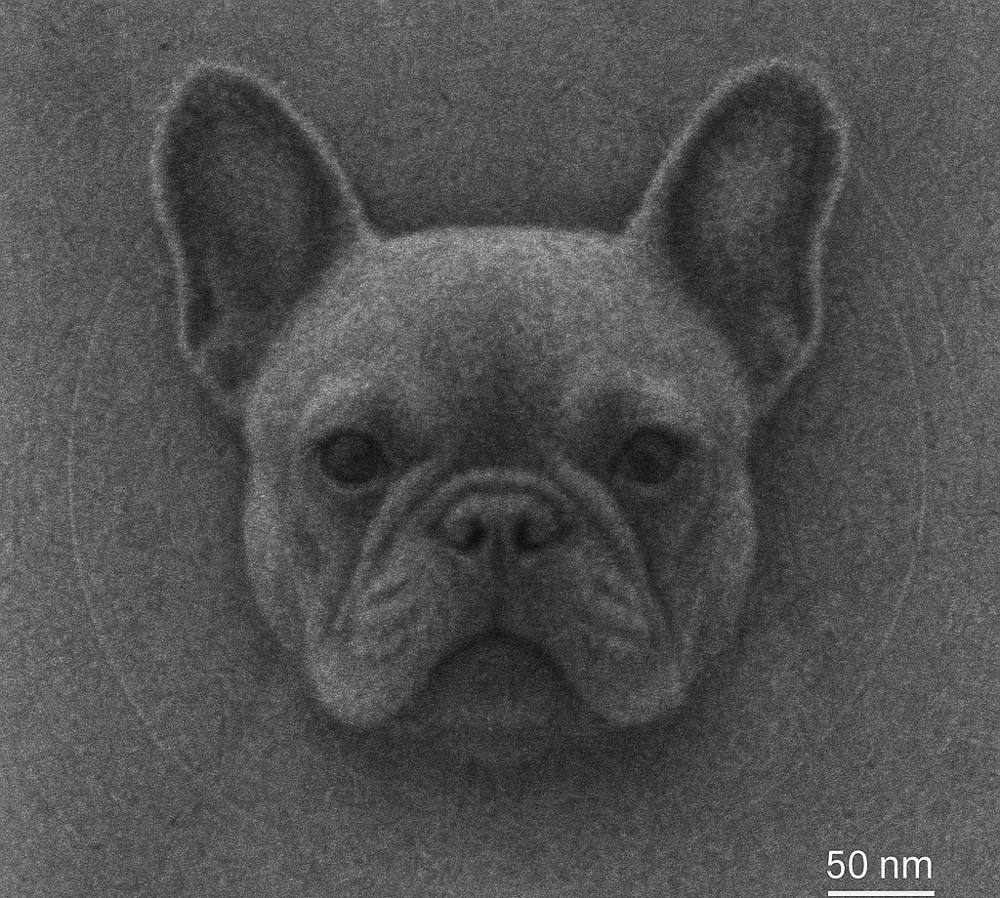

[](https://www.python.org/downloads/)
[](https://www.gnu.org/licenses/gpl-3.0.en.html)
[](https://cryodl.readthedocs.io/en/latest/?badge=latest)
[](https://badge.fury.io/py/yagwip)

# cryoDL: A Pypeline for CryoEM Deep Learning Utilities
<p align="center">
  
</p>

## Features

- **Configuration Management**: Centralized configuration system with JSON-based storage
- **Dependency Management**: Easy setup and validation of cryo-EM software dependencies
- **CLI Interface**: Command-line tools for configuration management
- **Path Validation**: Automatic validation of dependency paths and executables
- **Cross-platform**: Works on Windows, macOS, and Linux

## Quick Start

### Installation

#### Option 1: Install from source (recommended for development)

1. Clone the repository:
```bash
git clone https://github.com/ndlevinzon/cryoDL
cd cryoDL
```

2. Install in development mode:
```bash
pip install -e .
```

#### Option 2: Install with conda

1. Create and activate a conda environment:
```bash
conda create -n cryodl python=3.8
conda activate cryodl
```

2. Install the package:
```bash
pip install -e .
```

#### Option 3: Install with pip (when published to PyPI)

```bash
pip install cryodl
```

After installation, you can use the `cryodl` command directly from anywhere in your terminal!

#### Quick Installation Scripts

For Linux/macOS:
```bash
chmod +x install.sh
./install.sh
```

For Windows:
```cmd
install.bat
```

### Basic Usage

After installation, you can use the `cryodl` command directly:

1. Initialize the configuration:
```bash
cryodl init
```

2. Add your cryo-EM software dependencies:
```bash
cryodl add-dependency relion /usr/local/relion/bin/relion 4.0
cryodl add-dependency cryosparc /opt/cryosparc 4.0.0
cryodl add-dependency topaz /path/to/topaz 0.2.5
cryodl add-dependency model_angelo /path/to/model_angelo 1.0.0
```

3. Validate your dependencies:
```bash
cryodl validate-dependencies
```

4. View your configuration:
```bash
cryodl show
```

5. Generate SLURM headers:
```bash
cryodl slurm generate --job-name model_angelo
cryodl slurm generate --job-name topaz --nodes 2 --gres-gpu 2
```

## Configuration Manager

The `ConfigManager` class provides a comprehensive interface for managing project configuration.

### Python API Usage

```python
from src.config_manager import ConfigManager

# Initialize config manager
config = ConfigManager()

# Get configuration values
project_root = config.get('paths.project_root')
max_threads = config.get('settings.max_threads', 4)

# Set configuration values
config.set('settings.max_threads', 8)
config.set('settings.gpu_enabled', True)

# Manage dependencies
config.update_dependency_path('relion', '/usr/local/relion/bin/relion', '4.0')
config.update_dependency_path('cryosparc', '/opt/cryosparc', '4.0.0')
config.update_dependency_path('topaz', '/path/to/topaz', '0.2.5')
config.update_dependency_path('model_angelo', '/path/to/model_angelo', '1.0.0')

# Validate dependencies
is_valid = config.validate_dependency_path('relion')

# Get enabled dependencies
enabled_deps = config.get_enabled_dependencies()
```

### CLI Commands

| Command | Description | Example |
|---------|-------------|---------|
| `init` | Initialize default configuration | `cryodl init` |
| `get` | Get configuration value | `cryodl get paths.project_root` |
| `set` | Set configuration value | `cryodl set settings.max_threads 8` |
| `add-dependency` | Add/update dependency | `cryodl add-dependency relion /path/to/relion 4.0` |
| `list-dependencies` | List all dependencies | `cryodl list-dependencies` |
| `validate-dependencies` | Validate dependency paths | `cryodl validate-dependencies` |
| `show` | Show full configuration | `cryodl show` |
| `reset` | Reset to defaults | `cryodl reset` |
| `export` | Export configuration | `cryodl export config_backup.json` |
| `import` | Import configuration | `cryodl import config_backup.json` |
| `fasta` | Build FASTA files from PDB IDs | `cryodl fasta 2BG9` |
| `fasta --multiple` | Build FASTA from multiple PDB IDs | `cryodl fasta --multiple 2BG9 4B2T` |
| `fasta --annotate` | Create structure-sequence alignments | `cryodl fasta --annotate structure.cif sequences.fasta` |

## Configuration Structure

The configuration is stored in `config.json` with the following structure:

```json
{
    "project_info": {
        "name": "cryoDL",
        "version": "0.1.0",
        "description": "Python wrapper for cryo-EM software"
    },
    "paths": {
        "project_root": "/path/to/cryoDL",
        "src_dir": "/path/to/cryoDL/src",
        "docs_dir": "/path/to/cryoDL/docs",
        "output_dir": "/path/to/cryoDL/output",
        "temp_dir": "/path/to/cryoDL/temp"
    },
    "dependencies": {
        "relion": {
            "path": "/usr/local/relion/bin/relion",
            "version": "4.0",
            "enabled": true
        },
        "cryosparc": {
            "path": "/opt/cryosparc",
            "version": "4.0.0",
            "enabled": true
        },
        "eman2": {
            "path": "",
            "version": "",
            "enabled": false
        },
        "cisTEM": {
            "path": "",
            "version": "",
            "enabled": false
        },
        "topaz": {
            "path": "/path/to/topaz",
            "version": "0.2.5",
            "enabled": true
        },
        "model_angelo": {
            "path": "/path/to/model_angelo",
            "version": "1.0.0",
            "enabled": true
        }
    },
    "settings": {
        "max_threads": 4,
        "memory_limit_gb": 16,
        "gpu_enabled": false,
        "debug_mode": false,
        "log_level": "INFO"
    },
    "api_keys": {
        "cryosparc_license": "",
        "relion_license": ""
    }
}
```

## Supported Dependencies

The configuration manager is pre-configured for common cryo-EM software:

- **RELION**: Single-particle analysis software
- **CryoSPARC**: Cryo-EM structure determination platform
- **EMAN2**: Image processing suite for electron microscopy
- **cisTEM**: Single-particle analysis software
- **Topaz**: Deep learning-based particle picking for cryo-EM
- **ModelAngelo**: AI-powered protein structure modeling from cryo-EM maps

## Development

### Project Structure

```
cryoDL/
├── src/
│   ├── __init__.py
│   ├── config_manager.py    # Main configuration manager
│   ├── cli.py              # Command-line interface
│   └── resources/
├── docs/
├── config.json             # Generated configuration file
├── requirements.txt
└── README.md
```

### Adding New Dependencies

To add support for new cryo-EM software:

1. Update the `default_config` in `config_manager.py`
2. Add validation logic if needed
3. Update documentation

### Testing

Run the example usage:

```bash
python src/config_manager.py
```

## License

This project is licensed under the terms specified in the LICENSE file.

## Contributing

1. Fork the repository
2. Create a feature branch
3. Make your changes
4. Add tests if applicable
5. Submit a pull request

## Support

For issues and questions, please open an issue on the project repository.

## Citation

If you use CryoDL in your research, please cite:

```bibtex
@software{cryoDL2025,
  title={CryoDL: A Pypeline for CryoEM Deep Learning Utilities},
  author={Levinzon, Nate and Shen, Peter},
  year={2025},
  url={https://github.com/ndlevinzon/cryoDL}
}
```

Additionally, we are grateful for the following open-source projects that we build on top of:

### Topaz and Topaz Denoise
<details><summary>Citation</summary><p>
	
```bibtex
@Article{Bepler2019,
author={Bepler, Tristan
and Morin, Andrew
and Rapp, Micah
and Brasch, Julia
and Shapiro, Lawrence
and Noble, Alex J.
and Berger, Bonnie},
title={Positive-unlabeled convolutional neural networks for particle picking in cryo-electron micrographs},
journal={Nature Methods},
year={2019},
issn={1548-7105},
doi={10.1038/s41592-019-0575-8},
url={https://doi.org/10.1038/s41592-019-0575-8}
}
@Article{Bepler2020_topazdenoise,
author={Bepler, Tristan
and Kelley, Kotaro
and Noble, Alex J.
and Berger, Bonnie},
title={Topaz-Denoise: general deep denoising models for cryoEM and cryoET},
journal={Nature Communications},
year={2020},
issn={2041-1723},
doi={10.1038/s41467-020-18952-1},
url={https://doi.org/10.1038/s41467-020-18952-1}
}
```
</p></details>

### Model-Angelo
<details><summary>Citation</summary><p>
	
```bibtex
@article{jamali2024automated,
	author = {Kiarash Jamali and Lukas Kall and Rui Zhang and Alan Brown and Dari Kimanius and Sjors Scheres},
	title = {Automated model building and protein identification in cryo-EM maps},
	year = {2024},
	doi = {10.1038/s41586-024-07215-4},
	URL = {https://www.nature.com/articles/s41586-024-07215-4},
	journal = {Nature}
}
```
</p></details>
