[](https://www.python.org/downloads/)
[](https://www.gnu.org/licenses/gpl-3.0.en.html)
[](https://cryodl.readthedocs.io/en/latest/?badge=latest)
[](https://badge.fury.io/py/yagwip)

# **<ins>CryoDL<ins/>**
## A Pypeline for CryoEM Deep Learning Utilities
<p align="center">
  
</p>

## Features

- **Configuration Management**: Centralized configuration system with JSON-based storage
- **Dependency Management**: Easy setup and validation of cryo-EM software dependencies
- **CLI Interface**: Command-line tools for configuration management
- **Path Validation**: Automatic validation of dependency paths and executables
- **Cross-platform**: Works on Windows, macOS, and Linux

## Quick Start

### Installation

#### Option 1: Install from source (recommended for development)

1. Clone the repository:
```bash
git clone https://github.com/ndlevinzon/cryoDL
cd cryoDL
```

2. Install in development mode:
```bash
pip install -e .
```

#### Option 2: Install with conda

1. Create and activate a conda environment:
```bash
conda create -n cryodl python=3.8
conda activate cryodl
```

2. Install the package:
```bash
pip install -e .
```

#### Option 3: Install with pip (when published to PyPI)

```bash
pip install cryodl
```

After installation, you can use the `cryodl` command directly from anywhere in your terminal!

#### Quick Installation Scripts

For Linux/macOS:
```bash
chmod +x install.sh
./install.sh
```

For Windows:
```cmd
install.bat
```

### Basic Usage

After installation, you can use the `cryodl` command directly:

1. Initialize the configuration:
```bash
cryodl init
```

2. Add your cryo-EM software dependencies:
```bash
cryodl add-dependency topaz /path/to/topaz 0.2.5
cryodl add-dependency model_angelo /path/to/model_angelo 1.0.0
```

3. Validate your dependencies:
```bash
cryodl validate-dependencies
```

4. View your configuration:
```bash
cryodl show
```

5. Generate SLURM headers:
```bash
cryodl slurm generate --job-name model_angelo
cryodl slurm generate --job-name topaz --nodes 2 --gres-gpu 2
```

## Example Workflow

```mermaid
graph TD;
    Z{{FASTA}}-->A{Sanitize};
    A{Sanitize}-->B{{Database-Creation}};
    B{{Database-Creation}}-->C[Query];
    C[Query]-->D[Extract];
    C[Query]-->E[Extract-Contig];
    A{Sanitize}-->F[FASTA-Metrics];
    A{Sanitize}-->H[Split-FASTA];
    I[JSON/GenBank]-->J[Search];

    %% Custom style for Sanitize node
    style Z fill:#11d393,stroke:#fff5ee,stroke-width:4,font-size:30,color:#454545
    style A fill:#d48074,stroke:#fff5ee,stroke-width:3,font-size:26px
    style B fill:#d40078,stroke:#FCF5E5,stroke-width:2,font-size:22px
    style C fill:#920075,stroke:#333,stroke-width:1,font-size:18px
    style D fill:#650D89,stroke:#333,stroke-width:1,font-size:18px
    style E fill:#023788,stroke:#333,stroke-width:1,font-size:18px
    style F fill:#fd1d53,stroke:#333,stroke-width:1,font-size:18px
    style H fill:#2e2157,stroke:#333,stroke-width:1,font-size:18px
    style I fill:#11c9d3,stroke:#333,stroke-width:1,font-size:22px,color:#454545
    style J fill:#6e1515,stroke:#333,stroke-width:1,font-size:18px
```


## Supported Dependencies

The configuration manager is pre-configured for common cryo-EM software:

- **Topaz**: Deep learning-based particle picking for cryo-EM
- **ModelAngelo**: AI-powered protein structure modeling from cryo-EM maps

## Development

### Project Structure

```
cryoDL/
├── src/
│   ├── __init__.py
│   ├── config_manager.py    # Main configuration manager
│   ├── cli.py               # Command-line interface
│   ├── topaz_analysis.py    # Topaz analysis functions
│   ├── build_fastas.py      # FASTA building utilities
│   └── resources/
├── docs/
├── config.json              # Generated configuration file
├── pyproject.toml
└── README.md
```

### Adding New Dependencies

To add support for new cryo-EM software:

1. Update the `default_config` in `config_manager.py`
2. Add validation logic if needed
3. Update documentation

### Testing

Run the example usage:

```bash
python src/config_manager.py
```

## License

This project is licensed under the terms specified in the LICENSE file.

## Contributing

1. Fork the repository
2. Create a feature branch
3. Make your changes
4. Add tests if applicable
5. Submit a pull request

## Support

For issues and questions, please open an issue on the project repository.

## Citation

If you use CryoDL in your research, please cite:

```bibtex
@software{cryoDL2025,
  title={CryoDL: A Pypeline for CryoEM Deep Learning Utilities},
  author={Levinzon, Nate and Shen, Peter},
  year={2025},
  url={https://github.com/ndlevinzon/cryoDL}
}
```

Additionally, we are grateful for the following open-source projects that we build on top of:

### Topaz and Topaz Denoise
<details><summary>Citation</summary><p>
	
```bibtex
@Article{Bepler2019,
author={Bepler, Tristan
and Morin, Andrew
and Rapp, Micah
and Brasch, Julia
and Shapiro, Lawrence
and Noble, Alex J.
and Berger, Bonnie},
title={Positive-unlabeled convolutional neural networks for particle picking in cryo-electron micrographs},
journal={Nature Methods},
year={2019},
issn={1548-7105},
doi={10.1038/s41592-019-0575-8},
url={https://doi.org/10.1038/s41592-019-0575-8}
}
@Article{Bepler2020_topazdenoise,
author={Bepler, Tristan
and Kelley, Kotaro
and Noble, Alex J.
and Berger, Bonnie},
title={Topaz-Denoise: general deep denoising models for cryoEM and cryoET},
journal={Nature Communications},
year={2020},
issn={2041-1723},
doi={10.1038/s41467-020-18952-1},
url={https://doi.org/10.1038/s41467-020-18952-1}
}
```
</p></details>

### Model-Angelo
<details><summary>Citation</summary><p>
	
```bibtex
@article{jamali2024automated,
	author = {Kiarash Jamali and Lukas Kall and Rui Zhang and Alan Brown and Dari Kimanius and Sjors Scheres},
	title = {Automated model building and protein identification in cryo-EM maps},
	year = {2024},
	doi = {10.1038/s41586-024-07215-4},
	URL = {https://www.nature.com/articles/s41586-024-07215-4},
	journal = {Nature}
}
```
</p></details>
